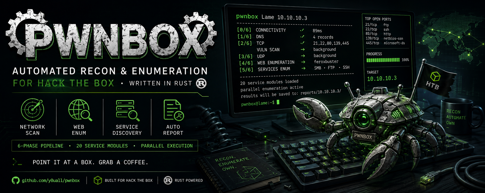

<p align="center">
  
</p>

<h1 align="center">pwnbox</h1>

<p align="center">
  Automated recon & enumeration for <a href="https://www.hackthebox.com/">HackTheBox</a>, written in Rust.
</p>

<p align="center">
  
  
  
</p>

---

Point it at a box, grab a coffee. When you come back you'll have a full port scan, service enumeration, default cred checks, directory brute results, and a list of next steps ready to go.

## How it works

pwnbox runs a **6-phase pipeline** — each phase feeds into the next, and slow tasks (UDP, vuln scripts, feroxbuster) run in the background so nothing blocks.

```
[0/6] Connectivity    ping + TTL-based OS guess
[1/6] DNS             zone transfer, reverse DNS, auto /etc/hosts
[2/6] TCP             rustscan -> nmap -sC -sV on open ports
  [bg] Vuln scan      nmap --script vuln (background)
[3/6] UDP             top 100 ports (background, needs sudo)
[4/6] Web             curl, whatweb, feroxbuster, vhost brute (background)
[5/6] Services        parallel: SSH, FTP, SMB, RPC, NFS, LDAP, Kerberos,
                      MySQL, PostgreSQL, Redis, MSSQL, SMTP, SNMP, WinRM
```

Everything gets collected into a **text report**, an optional **JSON report**, and saved nmap output files you can grep through later.

## Features

- **20 service modules** with automatic detection based on open ports
- **Parallel execution** via tokio — service scans, dir brute, vhost scan all run concurrently
- **Default credential testing** for MySQL, PostgreSQL, Redis, MSSQL, FTP
- **SSL cert hostname discovery** — extracts CN/SAN from HTTPS certs
- **Auto /etc/hosts** — discovered hostnames are added automatically
- **`--fast` mode** — TCP + web headers only, done in under a minute
- **`--resume`** — reuse cached nmap output on re-runs
- **`--watch N`** — re-scan ports every N minutes, alert on changes
- **Config-driven** — wordlists, tool paths, timeouts all in `config.toml`
- **Tool dependency checker** — warns about missing tools at startup

## Installation

### Quick (Kali / Ubuntu / Debian)

```bash
sudo ./setup.sh
```

This installs all dependencies and builds pwnbox to `/usr/local/bin/`.

### Manual

```bash
curl --proto '=https' --tlsv1.2 -sSf https://sh.rustup.rs | sh
cargo build --release
sudo cp target/release/pwnbox /usr/local/bin/
```

### Pre-built binary

```bash
chmod +x pwnbox
sudo mv pwnbox /usr/local/bin/
```

## Usage

```
pwnbox <BOX_NAME> <IP> [OPTIONS]
```

### Examples

```bash
# full scan
pwnbox Lame 10.10.10.3

# fast mode — TCP + web headers only
pwnbox Lame 10.10.10.3 --fast

# skip services you don't need
pwnbox Lame 10.10.10.3 --skip smb,ldap,udp

# resume a previous scan (reuse cached nmap output)
pwnbox Lame 10.10.10.3 --resume

# JSON output alongside text report
pwnbox Lame 10.10.10.3 --json

# watch mode — re-scan every 5 minutes
pwnbox Lame 10.10.10.3 --watch 5

# custom output directory
pwnbox Lame 10.10.10.3 -o /tmp/lame-scan
```

### Options

| Flag | Description |
|---|---|
| `-f, --fast` | Quick mode: TCP scan + web headers only |
| `-s, --skip <SVC>` | Skip services (comma-separated: `smb,ldap,udp`) |
| `--resume` | Reuse cached nmap output from a previous run |
| `--json` | Write JSON report alongside text report |
| `--watch <MIN>` | Re-scan ports every N minutes, alert on changes |
| `-o, --output <PATH>` | Output directory (default: `~/htb/<box>/`) |
| `-c, --config <PATH>` | Path to config.toml |
| `--init-config` | Generate a default `config.toml` and exit |
| `-v, --verbose` | Show full tool output |
| `-t, --timeout <SECS>` | Global timeout per command |
| `--ferox-threads <N>` | Feroxbuster thread count |

## Output

Reports are saved to `~/htb/<boxname>/`:

```
~/htb/lame/
  lame-20260331-180059.txt      text report
  lame-20260331-180059.json     JSON report (with --json)
  raw/                          raw tool output (also the --resume cache)
    nmap-tcp.txt                raw nmap TCP output
    nmap-udp.txt                raw nmap UDP output
    nmap-vuln.txt               vuln scan output
    ferox-80.txt                directory brute results
    vhosts-443.txt              virtual host discoveries
```

## Configuration

```bash
pwnbox --init-config
```

Config search order: `./config.toml` -> `~/.config/pwnbox/config.toml` -> built-in defaults.

```toml
[defaults]
timeout = 300
ferox_threads = 50
fast = false
verbose = false

[wordlists]
dir_medium = ["/opt/SecLists/Discovery/Web-Content/raft-medium-directories.txt"]
dns_subdomains = ["/opt/SecLists/Discovery/DNS/subdomains-top1million-5000.txt"]
usernames = ["/opt/SecLists/Usernames/xato-net-10-million-usernames.txt"]

[tools]
# override tool paths if they're not in $PATH (leave empty for default)
nmap = ""
rustscan = ""
feroxbuster = ""
```

## Required Tools

**Must have** (pwnbox won't start without these):
- `nmap`, `curl`

**Recommended** (pwnbox warns if missing):
- `rustscan` — fast port discovery
- `feroxbuster` — directory brute-forcing
- `ffuf` or `gobuster` — vhost scanning
- `ping` — connectivity/TTL hint (recon continues with `nmap -Pn` without ICMP)

Run `sudo ./setup.sh` to install everything at once.

## Building from source

```bash
cargo build --release
cargo test
cargo clippy -- -D warnings
```

Requires Rust 1.85+ (edition 2024).

## License

[MIT](LICENSE)
